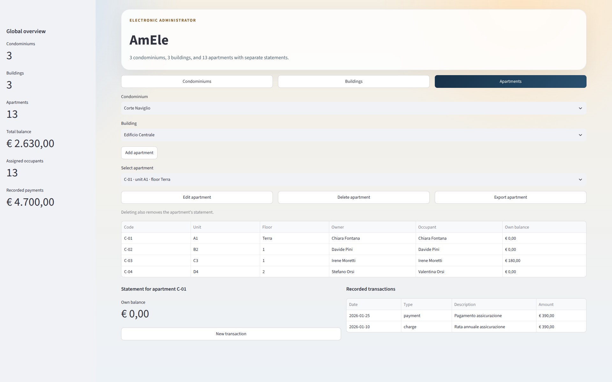
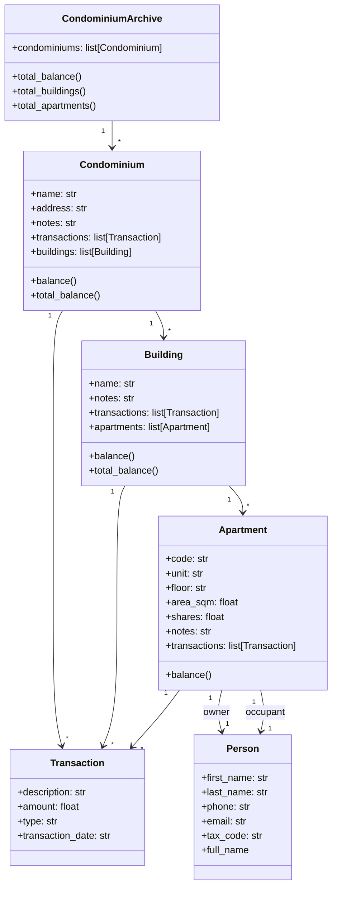
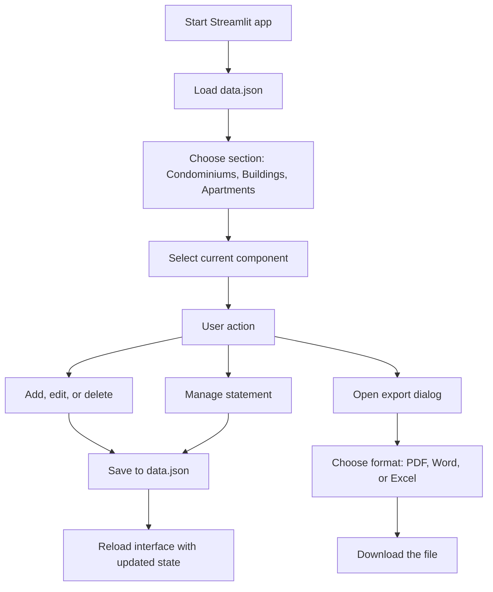
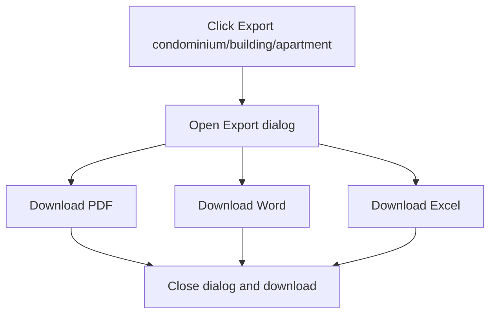

# AmEle: simple condo manager

AmEle is a small [Streamlit](https://streamlit.io/) application for managing a condominium archive with a hierarchical structure:

- an archive contains multiple condominiums
- each condominium contains multiple buildings
- each building contains multiple apartments
- each level has its own financial statement

The app lets you work on the data through a graphical interface, saving it to the `data.json` file.




## Project structure

- [`app.py`](https://github.com/matteogiorgi/amele/blob/main/app.py): Streamlit graphical interface
- [`models.py`](https://github.com/matteogiorgi/amele/blob/main/models.py): data model, JSON loading and saving logic
- [`data.json`](https://github.com/matteogiorgi/amele/blob/main/data.json): persistent data archive
- [`requirements.txt`](https://github.com/matteogiorgi/amele/blob/main/requirements.txt): Python dependencies to install with `pip`
- [`.streamlit/config.toml`](https://github.com/matteogiorgi/amele/blob/main/.streamlit/config.toml): Streamlit UI configuration (light theme, minimal toolbar)


## Data model

The hierarchy is as follows:

- `CondominiumArchive` — the root container; holds every condominium and exposes archive-wide totals.
  - holds the list of condominiums
- `Condominium` — a condominium complex, grouping one or more buildings under one address.
  - main condominium data
  - list of buildings
  - own statement
- `Building` — a single building block within a condominium, grouping its apartments.
  - main building data
  - list of apartments
  - own statement
- `Apartment` — one real estate unit; its `shares` field is the ownership quota (the Italian *millesimi*) used to apportion condominium expenses.
  - real estate unit data
  - owner
  - occupant
  - own statement
- `Person` — a condominium member, referenced as either an apartment's owner or occupant.
  - first name
  - last name
  - phone
  - email
  - tax code
- `Transaction` — one accounting entry: a `charge` adds to the balance, a `payment` reduces it.
  - description
  - amount
  - type (`charge` or `payment`)
  - transaction date


### Class diagram




### Balances

Balances are kept separate per level:

- `Own balance`: only counts the transactions of the current component
- `Total balance`: adds the own balance to the balances of the child levels

So:

- an apartment only has an `Own balance`
- a building has an `Own balance` and a `Total balance` combined with its apartments
- a condominium has an `Own balance` and a `Total balance` combined with its buildings and their apartments


## Main features

The app is organized into three sections: *Condominiums*, *Buildings*, *Apartments*. In each section you can:

- select the current context through dropdowns
- add a new item with a modal dialog
- edit an existing item with a modal dialog
- delete an item with a confirmation modal
- see a summary table consistent with the selected level
- manage the statement of the selected component
- export the full state of the selected component through a single dialog


### Main flow




### Statements

Each section also contains the statement of the selected component. From here you can:

- see the balances
- see the recorded transactions
- add a new transaction with a modal dialog


### Owner and occupant

Both an owner and an occupant are managed for every apartment; rule used in the app:

- if you leave the occupant fields empty when adding or editing, the occupant is automatically set equal to the owner
- if the occupant is different from the owner, you can fill it in manually


## Document export

From every section you can export the selected component by opening a dedicated dialog: *Export condominium*, *Export building* and *Export apartment*. Then, each of the options as three available formats: PDF, Word (`.docx`), Excel (`.xlsx`).

Exported documents contain:

- main data of the component
- any linked items
- recorded transactions
- balances
- condominium location and generation date in document format


### Export flow diagram




## Data file compatibility

Data is saved to `data.json`. The loader in `models.py` also handles data normalization:

- if it finds old owners saved as a plain string, it converts them to the new person format
- if the occupant is missing, it sets it equal to the owner
- if it finds the old flat format without a condominium archive, it automatically converts it to the new hierarchical format


## Requirements

- Python 3.10 or later
- `pip`

Python dependencies:

- `streamlit`
- `reportlab`
- `openpyxl`
- `python-docx`

You can install them with:

```bash
pip install -r requirements.txt
```


## Running the app

Create and activate a virtual environment, install the dependencies, then start the app:

```bash
python3 -m venv .venv
source .venv/bin/activate  # on Windows: .venv\Scripts\activate
pip install -r requirements.txt
streamlit run app.py
```

If you already have a virtual environment, just activate it first, or call the correct binary directly.


## Generated and ignored files

The repository includes a `.gitignore` that ignores:

- `__pycache__/`
- `.venv/`
- `tags`
- `.codex`


## Practical notes

- the `data.json` file is updated whenever you save operations from the interface
- the dataset can be populated with sample data to test the app more easily
- if you want to start from scratch, you can empty or replace the contents of `data.json`
