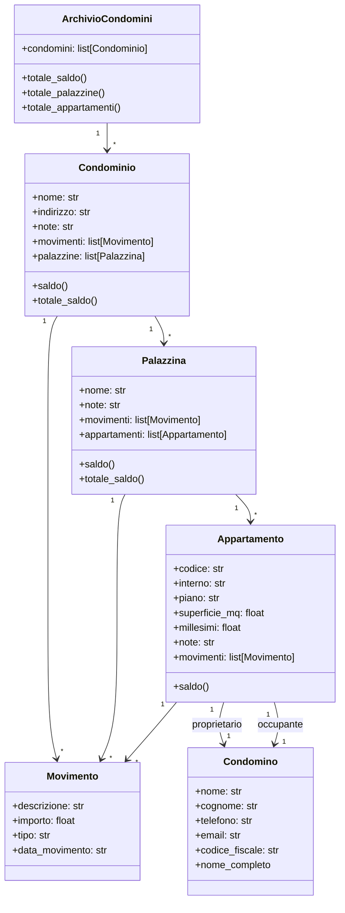
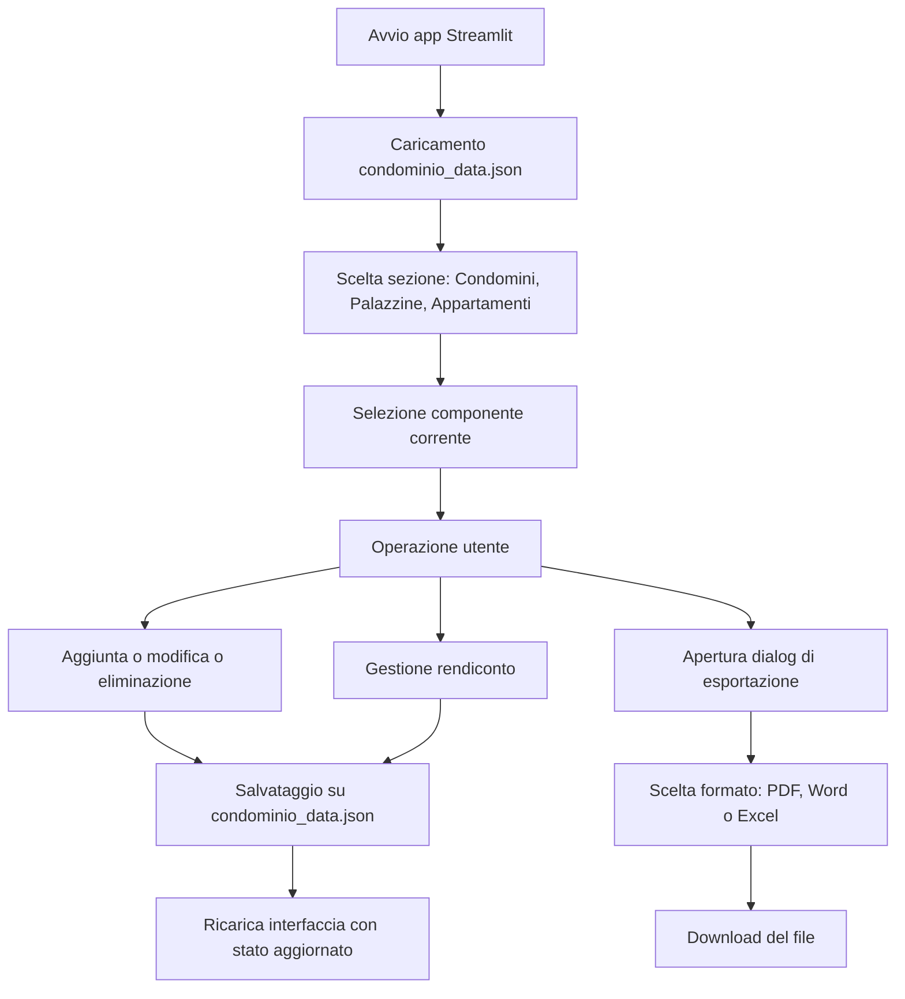
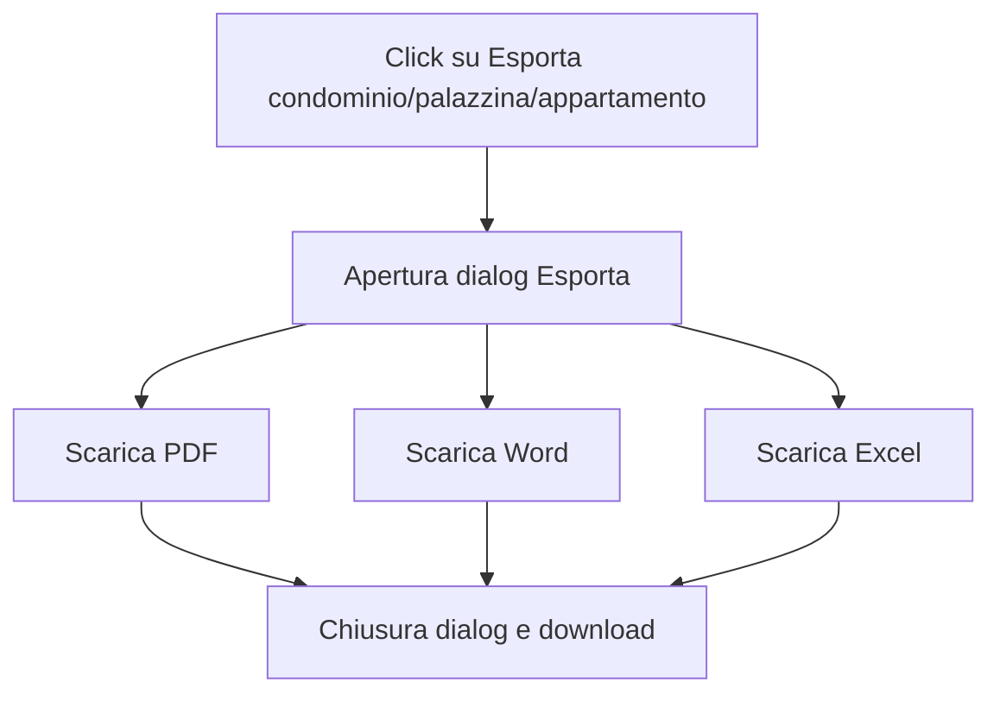

# AmEle

AmEle e una piccola applicazione Streamlit per gestire un archivio di condomini con struttura gerarchica:

- un archivio contiene piu condomini
- ogni condominio contiene piu palazzine
- ogni palazzina contiene piu appartamenti
- ogni livello ha il proprio rendiconto spese

L'app permette di lavorare sui dati da interfaccia grafica, salvandoli nel file `condominio_data.json`.


## Struttura del progetto

- `app_streamlit.py`: interfaccia grafica Streamlit
- `condominio.py`: modello dati, logica di caricamento e salvataggio JSON
- `condominio_data.json`: archivio persistente dei dati
- `requirements.txt`: dipendenze Python da installare con `pip`


## Modello dati

La gerarchia è questa:

- `ArchivioCondomini`
  - contiene la lista dei condomini
- `Condominio`
  - dati principali del condominio
  - lista delle palazzine
  - rendiconto proprio
- `Palazzina`
  - dati principali della palazzina
  - lista degli appartamenti
  - rendiconto proprio
- `Appartamento`
  - dati dell'unita immobiliare
  - proprietario
  - occupante
  - rendiconto proprio
- `Condomino`
  - nome
  - cognome
  - telefono
  - email
  - codice fiscale
- `Movimento`
  - descrizione
  - importo
  - tipo (`addebito` o `pagamento`)
  - data del movimento

### Diagramma delle classi




### Saldi

I saldi sono separati per livello:

- `Saldo proprio`: considera solo i movimenti del componente corrente
- `Saldo complessivo`: somma il saldo proprio con quello dei livelli figli

Quindi:

- un appartamento ha solo `Saldo proprio`
- una palazzina ha `Saldo proprio` e `Saldo complessivo` con gli appartamenti
- un condominio ha `Saldo proprio` e `Saldo complessivo` con le palazzine e i relativi appartamenti


## Funzioni principali

L'app e organizzata in tre sezioni:

- `Condomini`
- `Palazzine`
- `Appartamenti`

In ciascuna sezione puoi:

- selezionare il contesto corrente tramite tendine
- aggiungere un nuovo elemento con finestra modale
- modificare un elemento esistente con finestra modale
- eliminare un elemento con conferma modale
- vedere una tabella riepilogativa coerente col livello selezionato
- gestire il rendiconto del componente selezionato
- esportare lo stato completo del componente selezionato tramite una dialog unica

### Flusso principale




### Rendiconti

Ogni sezione contiene anche il rendiconto del componente selezionato. Da qui puoi:

- vedere i saldi
- vedere i movimenti registrati
- aggiungere un nuovo movimento tramite finestra modale


### Proprietario e occupante

Per ogni appartamento vengono gestiti sia proprietario sia occupante.

Regola usata nell'app:

- se in inserimento o modifica lasci vuoti i campi dell'occupante, l'occupante viene impostato automaticamente uguale al proprietario
- se l'occupante e diverso dal proprietario, puoi compilarlo manualmente


## Esportazione documenti

Da ogni sezione puoi esportare il componente selezionato aprendo una dialog dedicata:

- `Esporta condominio`
- `Esporta palazzina`
- `Esporta appartamento`

Formati disponibili:

- `PDF`
- `Word (.docx)`
- `Excel (.xlsx)`

I documenti esportati contengono:

- dati principali del componente
- eventuali elementi collegati
- movimenti registrati
- saldi
- luogo del condominio e data di generazione in formato documentale

### Diagramma del flusso di esportazione




## Compatibilita del file dati

I dati vengono salvati in `condominio_data.json`.

Il loader in `condominio.py` gestisce anche la normalizzazione dei dati:

- se trova vecchi proprietari salvati come stringa, li converte nel nuovo formato anagrafico
- se l'occupante manca, lo imposta uguale al proprietario
- se trova il vecchio formato piatto senza archivio di condomini, lo converte automaticamente nel nuovo formato gerarchico


## Requisiti

- Python 3.10 o superiore
- `pip`

Dipendenze Python:

- `streamlit`
- `reportlab`
- `openpyxl`
- `python-docx`

Puoi installarle con:

```bash
pip install -r requirements.txt
```


## Avvio

Per avviare l'app:

```bash
streamlit run app_streamlit.py
```

Se usi un ambiente virtuale, attivalo prima oppure richiama direttamente il binario corretto.


## File generati e ignorati

Il repository include un `.gitignore` che ignora:

- `__pycache__/`
- `.venv/`
- `tags`
- `.codex`


## Note pratiche

- il file `condominio_data.json` viene aggiornato quando salvi le operazioni dall'interfaccia
- il dataset puo essere popolato con dati fittizi per testare piu facilmente l'app
- se vuoi partire da zero, puoi svuotare o sostituire il contenuto di `condominio_data.json`
